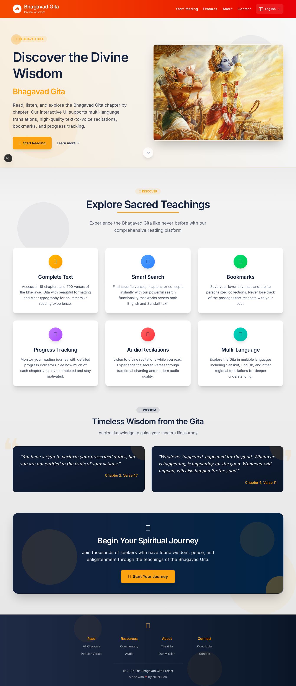

# theGita
A multilingual digital experience of the Bhagavad Gita — explore every śloka with translations, explanations, and soothing text-to-speech audio in multiple languages. Built with Next.js for the web and extended to mobile, making timeless wisdom accessible to the whole world.

## Live Demo
Access the live demo of the application at: [https://improved-dollop-74q9vj457v92pp9j-3000.app.github.dev/](https://improved-dollop-74q9vj457v92pp9j-3000.app.github.dev/)

Screenshot captured from the live demo (saved in `screenshots/site.png`):

